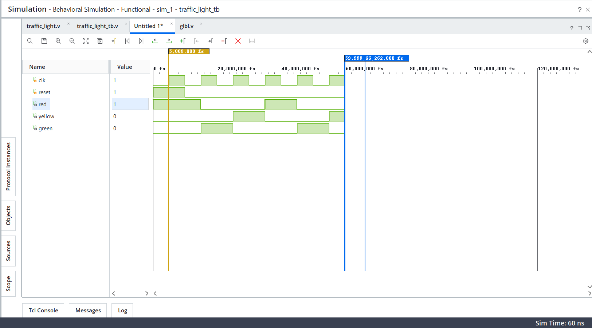

# Traffic Light Controller using Verilog HDL

A simple traffic light controller designed using Verilog HDL and simulated using Xilinx Vivado.

## Project Overview

This project implements a basic traffic light controller using a Finite State Machine (FSM).

The controller has three states:

- RED
- GREEN
- YELLOW

The sequence is:

RED → GREEN → YELLOW → RED

## FSM State Encoding

| State | Encoding |
|-------|----------|
| RED | 00 |
| GREEN | 01 |
| YELLOW | 10 |

## Inputs

- `clk` - Clock signal
- `reset` - Resets the controller to the RED state

## Outputs

- `red` - Red traffic light
- `yellow` - Yellow traffic light
- `green` - Green traffic light

## Tools Used

- Verilog HDL
- Xilinx Vivado
- Vivado Simulator

## Simulation

The design was simulated in Vivado to verify the correct transition between RED, GREEN, and YELLOW states.

Expected sequence:

RED → GREEN → YELLOW → RED

## Files

- `traffic_light.v` - Main traffic light controller
- `traffic_light_tb.v` - Verilog testbench

## Future Improvements

- Add a counter for realistic light durations
- Add pedestrian crossing control
- Implement the design on an FPGA board

## Simulation Waveform

The following waveform verifies the correct operation of the traffic light controller:

